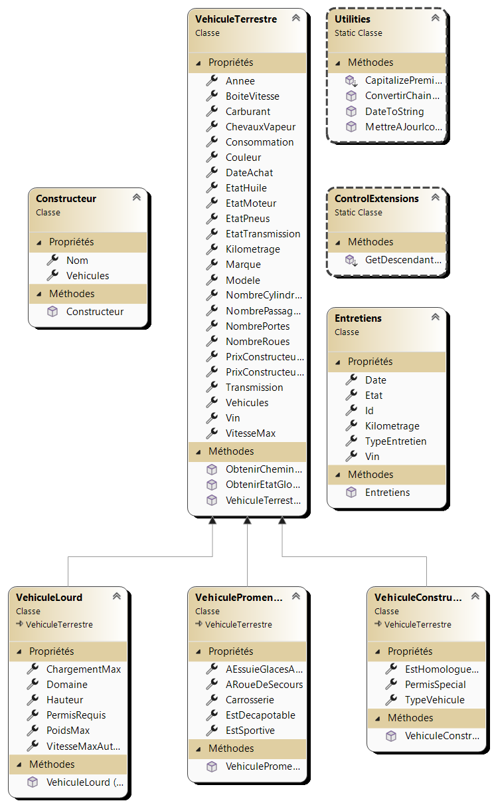
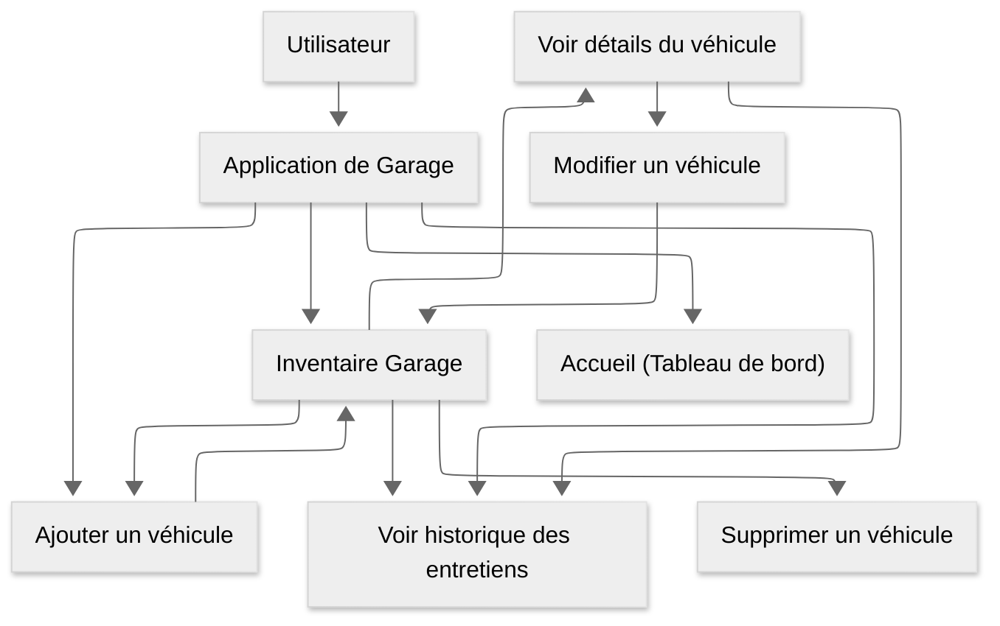

# Garage de *Rick* 

  

## **Description du Projet**    
Ce projet est une application de gestion pour le garage de Rick. Elle permet d'ajouter et de supprimer des véhicules du garage. Il est possible de voir les véhicules, leurs types, et plein d'autres spécifications des véhicules du garage, ainsi que de gérer les entretiens des véhicules.

---

## **Table des Matières**
1. [Fonctionnalités](#fonctionnalités)
2. [Diagramme de Classe](#diagramme-de-classe)
3. [Diagramme de Cas d'utilisation](#diagramme-de-cas-utilisation)
4. [Tests Unitaires](#tests-unitaires)

## **Fonctionnalités**
### **Gestion des Véhicules**
- Ajouter un véhicule au garage.
- Supprimer un véhicule du garage.
- Modifier les détails d'un véhicule.
- Afficher la liste des véhicules avec des options de filtrage et de tri.

### **Détails des Véhicules**
- VIN **(Format: `0AAAAAAAAAA00000`)**
- Modèle
- Couleur
- Année de fabrication
- Carburant **(Type: `Essence, Diesel`)**
- Nombre de roues
- Consommation **(`xx.x`/100km)**
- Vitesse maximale
- Chevaux
- Boîte de vitesse **(Type: `Automatique, Manuelle`)**
- Nombre de portes
- Prix d'achat
- Prix de vente actuel
- Date d'achat
- Kilométrage
- Constructeur **(Marque du véhicule)**
- ### **Véhicule de Construction**
  - Homologué pour la route
  - Permis requis **(Type: `Classe1, ClasseA, Classe1B, etc..`)**
  - Type **(`Pelleteuse, Excavatrice, Chargeuse, Nacelle-Élévatrice, Bulldozer, Grue`)**  
- ### **Véhicule de Promenade**
  - Catégorie **(`Berlines, Hayon, Utilitaire, Minifourgonnette, Décapotable, Coupé, Familiale, Camionnette, etc..`)**
  - Sportive
  - Décapotable
  - Essuie-glace arrière
  - Roue de secours
- ### **Véhicule Lourd**
  - Domaine **(`Transportation, Agricole, etc..`)**
  - Poids maximal
  - Permis requis **(Type: `Classe1, ClasseA, Classe1B, etc..`)**
  - Chargement maximal
  - Vitesse maximale autorisée

### **Fonctionnalités Avancées**
- Filtrage par marque, type de véhicule, et autres critères.
- Affichage de la valeur totale du garage.
- Gestion des entretiens pour chaque véhicule avec historique complet.

## **Diagramme de Classe**

## **Diagramme de Cas d'utilisation**

## **Tests Unitaires**
Le projet inclut des tests unitaires. 

### **Tests de l'AutoSuggestBox**
- Rechercher et sélectionner un VIN valide.
- Vérifier que les entretiens associés s'affichent correctement.

### **Tests du Convertisseur d'État**
- Convertir différents états en couleurs appropriées (Rouge, Orange, Gris).

### **Tests du Convertisseur de StringToBool**
- Convertir chaine de caractères en booléen. **(Exemple: "Oui" -> `true`))**
- Convertir booléen en chaine de caractères. **(Exemple: `true` -> "Oui"))**

### **Tests du Convertisseur de EntretienToVisibility**
- Vérifier que les entretiens s'affichent correctement.
- Vérifier que les entretiens sont masqués si aucun entretien n'est donné.

### **Tests de ajoutVehicule**
- Vérifier que les pages du formulaire s'affichent correctement selon le numéro de page.
- Vérifier que les champs des pages du formulaire sont affichés aussi selon la page.
